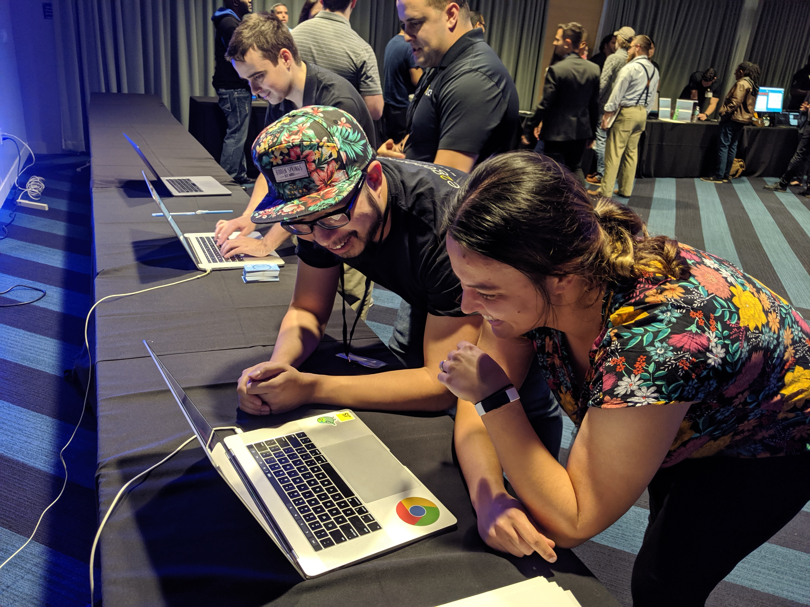

👋 I'm Vincent Tang, a web developer and former kitchen designer from Orlando. Currently I work as a fullstack developer at [E2 Generations](https://www.e2gens.com/), and teach at the local coding bootcamp. My work is also found in [DevTo](https://dev.to/vincentntang), [DevPost](https://devpost.com/vincentntang), [Codepen](https://codepen.io/vincentntang), [Stackoverflow](https://stackoverflow.com/users/3258462/vincent-tang) amongst others.

This website originally started as a way to document things I learn during a career change. But it's since changed. I love trying out new things, and this blog is a reflection of my [digital garden](https://joelhooks.com/digital-garden) where I learn in [public](https://www.swyx.io/writing/learn-in-public/).

There's more links to this site:

- ⚙️ **[Uses](/uses)** - Tools I use
- ⚙️ **[today-i-learned](/today-i-learned)** - [WIP] Stuff I learn
- ⚙️ **[appearance](/apperances)** - [WIP] - links to where I'm featured

My username is "vincentntang" across social media:

- 👋 **[Twitter](https://twitter.com/vincentntang)**
- 👋 **[Instagram](https://instagram.com/vincentntang)**
- 👋 **[Linkedin](https://linkedin.com/in/vincentntang)**
- 👋 **[Email](mailto:vincentntang+mydomain@gmail.com)**

<!--  -->

### OpenSource Projects

- [Asteroid Battlegrounds](https://github.com/vincentntang/asteroid_battlegrounds) - Typescript PhaserJS game based on ATARI Asteroids
- [Earthly](https://github.com/vincentntang/2018spaceappschallenge) - NASA 3D visualization exploration app
- [3D Box](https://github.com/vincentntang/canvas-vanishing-points) - 3D renderer built on 2D HTML Canvas
- [Movie Quotes](https://github.com/vincentntang/graphql-movie-quotes) - GraphQL NodeJS React App Tutorial for a conference talk
- [Vue Desk Configurator](https://codepen.io/vincentntang/pen/LKgWbv) - Vue App featured on frontpage of Codepen
- [vincent.dev](https://www.vincentntang.com/) - Gatsby site

More coding related work / talks I've done found here:

- 💾 **[Slides](https://slides.com/vincentntang/)**: Presentation slidedecks
- 💾 **[GitHub](https://github.com/vincentntang)**: Open source projects
- 💾 **[Codepen](https://codepen.io/vincentntang)**: Web doodles
- 💾 **[Devpost](https://devpost.com/vincentntang)**: Hackathon projects
- 💾 **[Stackoverflow](https://stackoverflow.com/users/3258462/vincent-tang)**: Knowledge wiki