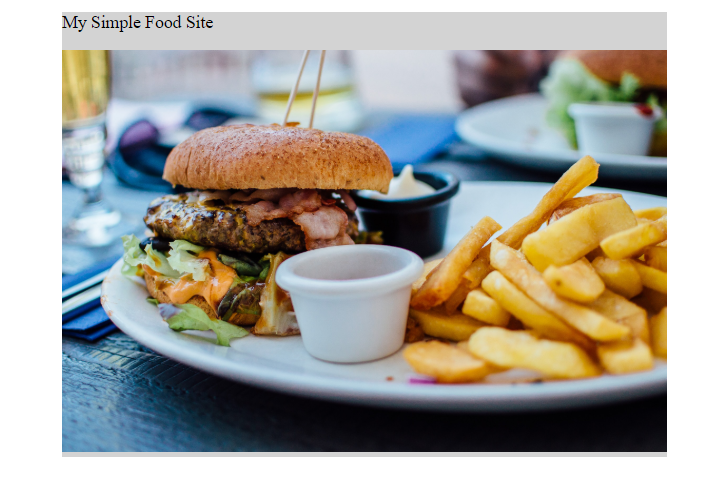
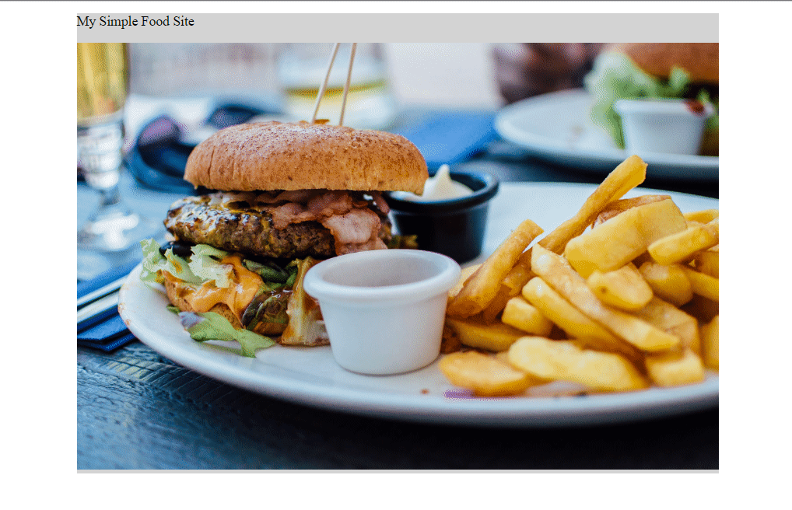

What is responsive web design?

It's a design that scales at any browser width size. Something that looks great on both mobile, tablet, and desktop views.

When you design a site, there are generally 2 approaches you can make

*   Mobile First
*   Desktop First

Designing a responsive site generally means you will be doing both of these things, but prioritize one over the other. There's no right away to go about it. For instance, if you are designing a site dedicated to food recipes, a mobile-first approach makes more sense. Designing a site specialized in legal contracts benefits from a desktop-first approach.

For a simple recipe food site, the CSS and HTML might look something like this:

```html
<div class="container">
  <p>My Simple Food Site</p>
  
</div>
```
```css
img {
  width: 100%;
}
.container {
  background-color: lightgrey;
  margin: 0 auto;
  width: 576px;
}
```



The site isn't exactly responsive yet. The image here is 2200px wide. If we wanted this site to be responsive using only CSS, you append media queries to the `container`

```css
img {
  width: 100%;
}
.container {
  background-color: lightgrey;
  margin: 0 auto;
  max-width: 100%; /* was 550px*/
}

@media only screen and (min-width: 576px){
  .container {
    max-width: 576px;
  }
}
@media only screen and (min-width: 768px){
  .container {
    max-width: 768px;
  }
}
```



Now we have a responsive site! The design approach using the above method is called a Mobile-First design. You first work with small mobile screens and write all your CSS classes natively this way. As the screen goes up, you limit the max-width respectively.

Writing media queries in pure CSS is not optimal. As your site gets more complex, you start having media queries everywhere. It becomes difficult to maintain.

As of now, media queries are off on its own, away from the main class. You can use a preprocessor like SASS to organize the media queries effectively. In this example, this is how you would do it:

```css
@mixin screen-min($min) { 
  @media (min-width: $min) { 
    @content 
  } 
};
img {
  width: 100%;
}
.container {
  background-color: lightgrey;
  margin: 0 auto;
  width: 100%; /* was 550px*/
  @include screen-min(576px){max-width: 576px;}
  @include screen-min(768px){max-width: 768px;}
}
```

- [Code Thus Far](https://codepen.io/vincentntang/pen/KGEgpm/)

This does the same job as the previous example. By writing your CSS this way, there is no longer a separation of concerns. All media queries associated with its class are inside of where it should be. So if you were to ever split your file, move things around to different folders, things become manageable.

`Screen-min` is a sass mixin, its a function that takes in an argument (in this case min-width) and generates the corresponding CSS.

This is just 1 of 3 sass mixins that you could use. The other ones look like this:

```scss
// 320px, 576px, 768px, 992px, 1200px, 1440px

// For Mobile-First Design
@mixin screen-min($min) { 
  @media (min-width: $min) { 
    @content 
  } 
};

// For Desktop-First Design
@mixin screen-max($max) { 
  @media (max-width: $max - 1) { 
    @content 
  } 
};

// For Hybrid Design
@mixin screen-minmax($min, $max){ 
  @media (min-width: $min) and (max-width: $max - 1){ 
    @content 
  }
};
```

If you want to define variable widths, you can define them at the top of your file, and use those instead of a specific value. Example included

```scss
$screen-sm : 576px;
$screen-md : 768px;
$screen-lg : 992px;
$screen-xl : 1200px;
```

Here is the same example codepen, with everything included. The 3 sass mixins you can use for responsive media queries, and additional variables you can use for breakpoints

- [Demo](https://codepen.io/vincentntang/pen/dgrpro/)

## A Look Into Alternatives

This is one way to organize media queries. I use a compressed snippet bound to a hotkey based on [14 useful phrase express macros developers](https://vincentntang.com/14-useful-phrase-express-macros-for-developers/). You can opt to use similar tooling in your favorite IDE.

Example typing `mixin#`


It's a compressed 3 liner I append to some of my codepen files. I like to add notes use common bootstrap breakpoints: 320px, 576px, 768px, 992px, 1200px, 1440px.

You can find other frameworks such as [breakpoint-sass](http://breakpoint-sass.com/) to organize media queries. I don't think it's necessary, because it's more abstractions behind the scenes.

Other ways to write modular media queries can be found on [css-tricks](https://css-tricks.com/approaches-media-queries-sass/).