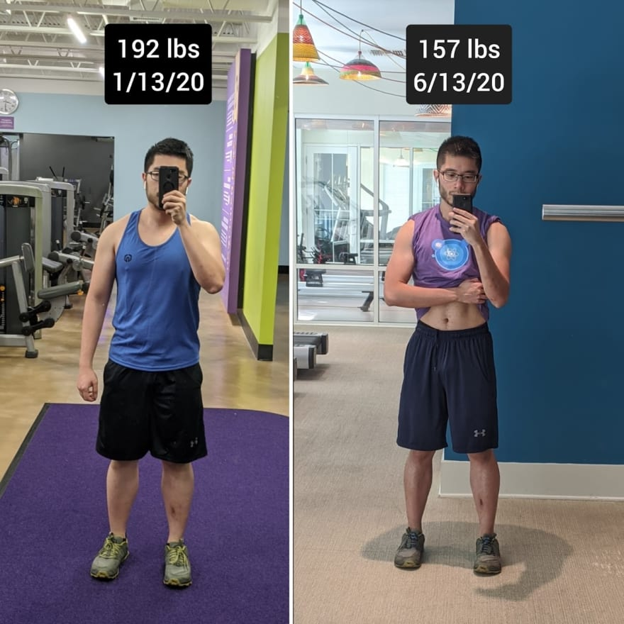
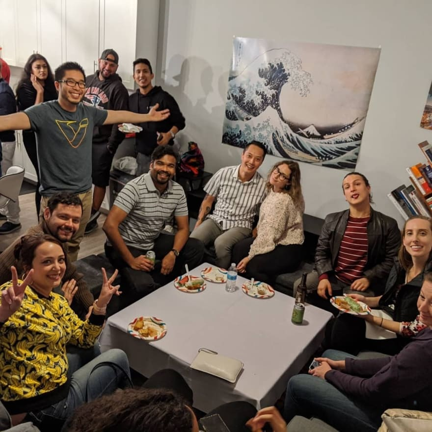
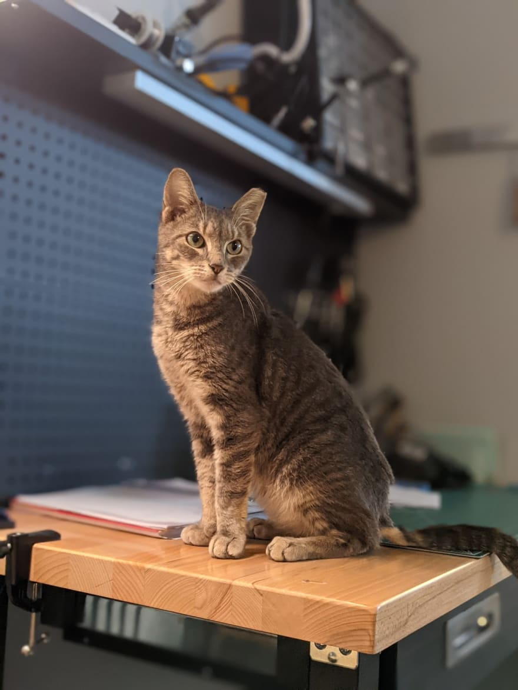
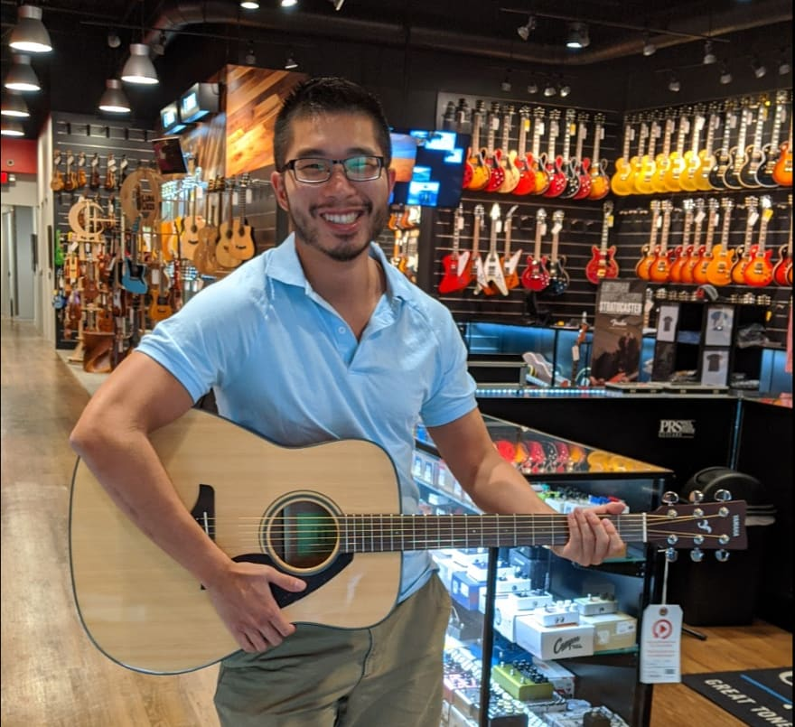

Every year I write a [blog post](https://www.vincentntang.com/2019-into-2020/) reflecting what I've learned and accomplished. And whether or not I met my goals for this year. It's a great way to see how far I've come since I started my coding journey.

Without further ado, here's my 2021 version!

## I started a coding podcast, and released **7** episodes!

I didn't plan on building a coding podcast this year. It all started when I was invited to the [backend-bears](https://backendbear.com/) coding podcast. I spoke with Marko about what it's like for a frontend developer to learn backend development. It was a blast reliving what it was like working at my first job, and the challenges I overcame to be where I am today. I had such a positive experience on this show that I decided to create my own, so I could invite my own guests too!

I reached out to one of my closest coding friends, German Gamboa to cohost with me. Thus [Code Chefs](https://codechefs.dev/) was born. We've been steadily releasing content every week, and have air'd 7 episodes so far:

- [1 - First Developer Jobs](https://www.codechefs.dev/first-developer-jobs)
- [2 - React vs Vue](https://www.codechefs.dev/react-vs-vue)
- [3 - Level up with Hackathons](https://www.codechefs.dev/hackathons)
- [4 - CSS Crash Course](https://www.codechefs.dev/css-crash-course)
- [5 - Fitness 101 for Developers](https://www.codechefs.dev/fitness)
- [6 - Intro to Backend Development](https://www.codechefs.dev/intro-to-backend)
- [7 - Intro to Quality Assurance](https://www.codechefs.dev/intro-to-qa)

I challenged myself to build the entire thing from scratch. Read about how it was built [here](https://www.vincentntang.com/custom-podcast-site-gatsby-react/). This coding podcast is the first real side project I've built since starting my coding journey.

## I wrote **10** blog articles

One of my goals this past year is to write more frequently. I wrote a few different articles reflecting upon my career, and things I learned while building [code chefs](https://codechefs.dev).

- [Inheriting a broken Javascript webapp and how to fix it](https://www.vincentntang.com/fixing-broken-webapp/)
- [Demystifying React useState](https://www.vincentntang.com/react-use-state-explained/)
- [Demystifying React useEffect](https://www.vincentntang.com/react-use-effect-explained/)
- [Customize Bootstrap in a React App](https://www.vincentntang.com/customize-bootstrap-with-react/)
- [Build a Custom Podcast Site with GatsbyJS, ReactJS, AmazonS3, and Netlify](https://www.vincentntang.com/custom-podcast-site-gatsby-react/)
- [How Competing in Hackathons helped me land my first job](https://www.vincentntang.com/custom-podcast-site-gatsby-react/)
- [Installing Blog Comments on your GatsbyJS/ ReactJS site using Utterances](https://www.vincentntang.com/installing-gatsbyjs-blog-comments/)
- [On writing a custom RSS feed for GatsbyJS](https://www.vincentntang.com/writing-custom-rss-gatsby/)
- [What are JAMstack Apps and Static Site Generators(SSG)](https://www.vincentntang.com/wtf-are-jamstack-apps-and-static-site-generators/)
- [Recommended Learning Path for a Self Taught Web Developer (React / NodeJS)](https://www.vincentntang.com/learning-path-for-self-taught-web-developer/)

## I did my **first** paid freelancing gig!

I've never done a paid freelancing gig before. Granted, I've helped in numerous startups when I first started programming, some spinning off from hackathon applications I wrote. I had the opportunity to work through a web agency on a VR project with Verizon.

Read about it [here](https://www.thedrum.com/news/2020/10/23/nightmares-are-loose-verizon-launches-virtual-immersive-experience-marketers)

## I dropped **35 lbs** in 6 months!

At the start of this year, before Covid hit, I started to become overweight. Namely, I just moved to a new city and found myself constantly eating out at new restaurants every day. I drew up a plan around January to drop weight for the first time in my life. This was done through a recipe tracker I made on google spreadsheet in which I tracked how many calories I ate every day and measured my weight progress over time. The biggest challenges for me here was adjusting to the new diet and discovering what things I did and didn't like eating. 

## I furnished my **first** apartment!

Every apartment I've lived in before this had been furnished. Before this, I had been couch surfing for several months in Tampa as I didn't know which area in town I wanted to live in. I settled in the old downtown district and have loved it ever since!

However, furnishing my first apartment was more difficult than I'd imagine. I never realized how many different combinations of styles and genre of interior decor exist out there. From chic, to country, to minimalistic - the combinations were endless. I ended up spending several weeks sleeping on Ikea sofas and couches nearby to find out what suits me best, an ungodly amount of time shopping online, and learning about something called [focal points](https://www.homenish.com/focal-point-interior-design/).

Here's what my place looks like, after throwing my first house warming Pre-Covid:

## I adopted my **first** cat

I've always wanted a furry companion. I never had one growing up. Although, one time my dad called me on my 12th birthday, proudly exclaiming he adopted a new dog. I was coming home from school when I got the news. I felt a rush of excitement as I couldn't wait to meet him! Upon arriving home, I didn't find a new dog dashing forward to meet me at the door. Confused, I called my dad and he told me to check near the staircase. I ended up finding a dog statue. I later found out we never had pets because my dad was allergic to them.

This past month I adopted my first cat companion, Monty. Prior to this, I had recently been laid off, so I used the free time I had to visit various animal shelters. Monty was actually one of the first cats I met at the first animal shelter I went to! I adopted him, and I later found out my entire team at my new job had cats.

Here's a picture of Monty:

## I redesigned my website

Around Q3 2019, I got laid off from Covid. With that free time, I used it to redo my website!

It's still based on a fork off of another popular theme, but suffice to say I've added a lot of new features to the site. Including the ability to add comments, a new newsletter, amongst many other cool features

## I learned musicality

This year I sought to explore personal skills over professional ones. I'm still trying to find myself, my identity, and how I'd like to be perceived by others. For that, I wanted to explore hobbies I never had done previously and skills I never was good at. So I focused on musicality - dancing, singing, and musical instruments.

Over the course of a few months, I learned how to play "Knocking on Heaven's Door" from ACDC/ Bob Dylan. Both a simple musical strum pattern and singing at the same time. It's a simple enough song and the lyrics aren't difficult, but I spent weeks learning about my voice, and what I could produce, given enough time and practice.

For dancing, I picked this up through a dance studio. I never thought it was something I'd enjoy, but I fell in love with how expressive it can be. You can tell a lot about someone's personality, just by the way they move. For instance, slower movements are associated with someone more relaxed, whereas someone who has style tends to be more expressive. Everyone has a different pattern and I'm still finding my own. 

## Goals this year

My goals last year were rather generic. This year I'm going to quantify what I'd like to achieve by the end of 2021

Professional goals:

- Build 1 side project that is primarily backend based
- Build 1 tool for creating cutting edge user-experiences / assets
- Build 1 fun hardware-based IoT project
- Get AWS solution architect associates certified
- Finish 1 computer science course, most likely NAND2Tetris
- Finish 1 course on Cypress Testing and Web-Accessibility

Personal goals:

- Increase overall strength by 30% by July, 135/175 bench/squat at 5x1 currently
- Create a financial stock portfolio
- Finish a course on improving charisma and be able to apply them to my life
- Improve my writing ability through writing more blog posts

That's my reflection for 2020 and my goals for this coming year! Most of my accomplishments this year were personal. It's the year in which I wanted to discover more about myself, amidst a pandemic