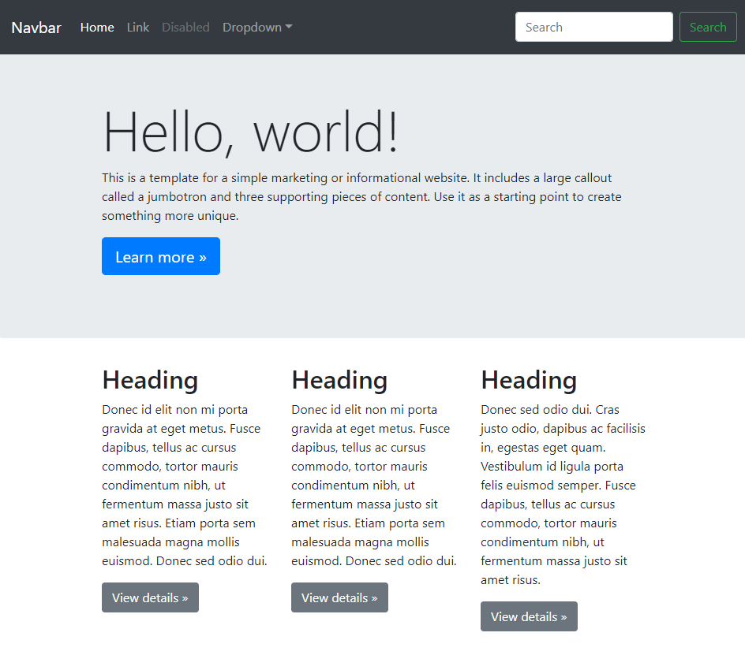

## Customizing Bootstrap

Bootstrap is the tried and true CSS framework that's been around forever. Ask any webdeveloper if they've heard of it, chances are
they've used it. It's a swiss army knife of tools that helps rapidly prototype webapps, and I'm a big fan of that.

However, it does have it's downsides. One, it looks the same as every other website out there! So you lose the unique value proposition,
and make a site that just feels lazy and not thought out. 



Re-inventing the wheel for every project, setting up whatever flavor of styles and media queries, is a no-go either. 
I enjoy the custom designing a website, but there are just days where throwing bootstrap in there just makes more sense. Especially with teams that are familiar with it.

Customizing bootstrap's not as hard as you think. You can tweak the colors so that someone won't even notice your using bootstrap, and
 that's a good thing! I'll show you how to do this with tools like React, Vue, or just a simple plain HTML site. I'll even show you
 how to add in your own custom stylesheets, so you have all the power to style anything you want - quickly with 0 hassles.
 This means you can change colors here and there with minimal amounts of effort!

And clear up misconceptions on how to do this, as well as easy workflows for your next project.

## Import bootstrap via npm

Bootstrap contains a list of `scss` files that gets compiled into a `css` file that can be referenced by an HTML file. You could download these files off the bootstrap's website, but I recommend using `npm` and node_modules instead

Why?

The thing is, you don't want to git-control the source files in bootstrap. You want to just modify the variables it references, so you can tweak the settings from the outside. This by design, is a good system because it prevents anyone working on the project modifying bootstrap directly. So anyone working on the project can confidently say "yap we are using bootstrap, and it's only been modified by what should be modified". There is a caveat, and this is making sure your source controlling the version of bootstrap your using.

You'll need a tool that compiles the `scss` file into a plain good ol' `css` file that can be used on the web.
If you use React, Vue, Angular, or any other mainstream javascript library, these have tools you can use already. Like webpack

If you aren't using these, you'll need to use grunt, parcel, gulp.js, prepros, or similar. I won't cover this part in particular, but
I'll show you how to set this up with React.

So let's say we're making a fresh react app

```
npx create-react-app my-app
cd my-app
```

So install these modules (you'll need to download [nodeJS](https://nodejs.org/en/) if you haven't already)

```
npm install bootstrap@4.3.1
npm install node-sass
```

This will download `bootstrap scss files` into your `node_modules` folder. `node-sass` is used to compile these files. 

Next thing you want to do, is import a `main.scss` file into where you'll be calling this file. 
We call this a rollup file, because it's going to referencing a ton of other files into it.

Inside the `base/` folder, you'll want to create a `bootstrap_variables` file, which you need to pull from the source code. This is where we'll do all of our customizations to bootsrap.

After that, in the `main.scss` file, add the imports from node_modules

```
//==============================================================================
// Bootstrap Customization
//==============================================================================
@import "~bootstrap/scss/functions";
@import "./base/bootstrap_variables";
@import "~bootstrap/scss/mixins";
@import "~bootstrap/scss/root";
@import "~bootstrap/scss/reboot";
@import "~bootstrap/scss/type";
@import "~bootstrap/scss/images";
@import "~bootstrap/scss/code";
@import "~bootstrap/scss/grid";
@import "~bootstrap/scss/tables";
@import "~bootstrap/scss/forms";
@import "~bootstrap/scss/buttons";
@import "~bootstrap/scss/transitions";
@import "~bootstrap/scss/dropdown";
@import "~bootstrap/scss/button-group";
@import "~bootstrap/scss/input-group";
@import "~bootstrap/scss/custom-forms";
@import "~bootstrap/scss/nav";
@import "~bootstrap/scss/navbar";
@import "~bootstrap/scss/card";
@import "~bootstrap/scss/breadcrumb";
@import "~bootstrap/scss/pagination";
@import "~bootstrap/scss/badge";
@import "~bootstrap/scss/jumbotron";
@import "~bootstrap/scss/alert";
@import "~bootstrap/scss/progress";
@import "~bootstrap/scss/media";
@import "~bootstrap/scss/list-group";
@import "~bootstrap/scss/close";
@import "~bootstrap/scss/toasts";
@import "~bootstrap/scss/modal";
@import "~bootstrap/scss/tooltip";
@import "~bootstrap/scss/popover";
@import "~bootstrap/scss/carousel";
@import "~bootstrap/scss/spinners";
@import "~bootstrap/scss/utilities";
@import "~bootstrap/scss/print";
```


This is the same code used in the base imports as bootstrap for version 4.3.1 (check the source code if it's any different). The `~` sign is a relative import to the `node_modules`, anywhere in your application

Now we can get to modifying actual variables!

Compile the code and make sure it runs. If you run into an issue, try running `rm -rf node_modules` and updating `package.json` to the actual suggested custom theme version name of bootstrap. At the time of writing this, it's version 4.3.1

package.json example:

```
"dependencies": {
    "bootstrap": "4.3.1",
}
```

To customize bootstrap you'll have to update the file `bootstrap_variables`

Here's an [example repo](https://github.com/vincentntang/react-app-with-custom-bootstrap) with preconfigurations to Bootstrap + React. 

