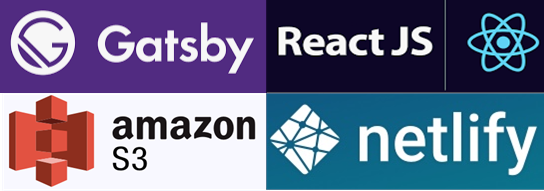
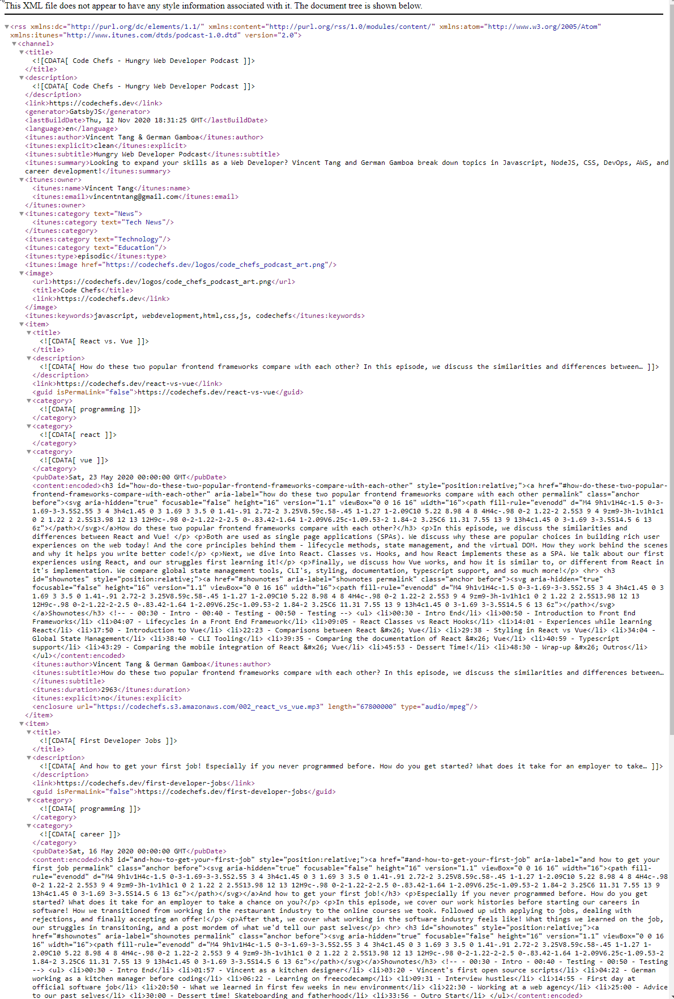
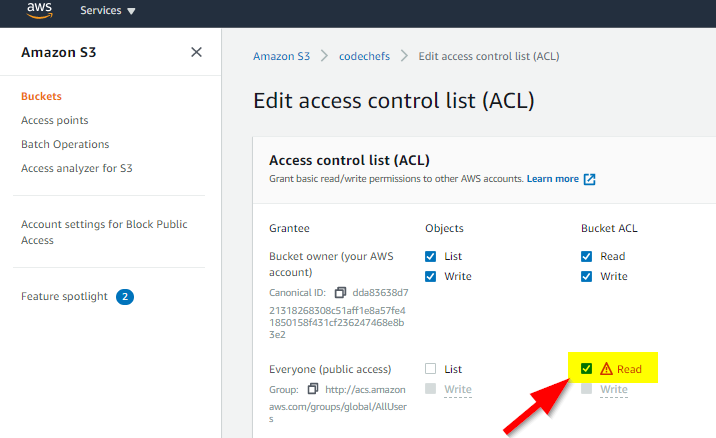
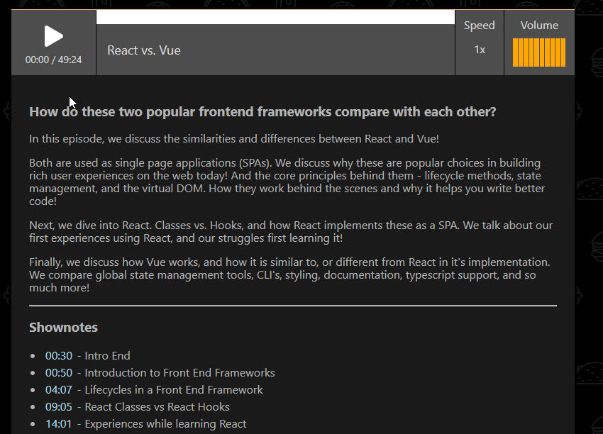
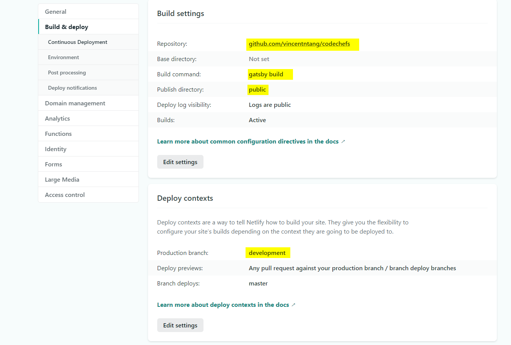

6 months ago, I reached out to one of my best buddies to start a coding podcast! We wanted to reflect upon our journey as software developers thus far, and push ourselves to greater limits.

Only recently, we released our podcast to all the major platforms! It's here at [Code Chefs](https://codechefs.dev)

We decided to build everything from scratch! We wanted full control over the distribution. So we could customize how it gets pushed out to Spotify, how ads are controlled, etc. And a website that could also be a podcast player too!

Here's how it's done with GatsbyJs, React, Netlify, and Amazon S3

## Overview of how the stack works



TL;DR 

- GatsbyJS hosts the website, markdown files, and generates RSS feeds for podcast platforms to consume
- AmazonS3 hosts mp3 files
- Netlify pushes the gatsby site to the frontend
- ReactJS for a custom media player on the website

GatsbyJS is a popular JAMstack framework built in React. It's used often in the blogging world, and a podcast website isn't that terribly different. Where one episode = one blog post.

Most podcast platforms like Spotify, Apple Podcasts, etc are controlled by an RSS feed. Since GatsbyJS provides this out of the box too, this meant we could fine-tune it to different platforms.

Hosting mp3 files is a different issue entirely. It equates to about 1-2 mB post-processed for every minute of audio. Hosting these files within the same bandwidth as the static frontend site doesn't make sense, so we opted for amazon S3

AmazonS3 is a great place for deploying static assets like images, videos, or mp3 files. It doesn't cost a lot either, I don't have analytics yet but it comes up to a few cents every month.

We specify in our `.md` files within Gatsby, where the hosted mp3 files are located in S3. This is then pulled into the RSS feed created when Gatsby builds. 

We push this code using Netlify where the site is hosted at `https://codechefs.dev`. Netlify has a CI/CD feature that lets you target a branch in your GitHub repo (in this case `development`), and anytime that branch is updated, the frontend site is too

The code for our podcast site is open source! Check it out on [here on github](https://github.com/vincentntang/codechefs)

## GatsbyJs and RSS Configuration

If you've used ReactJS before, GatsbyJS is actually quite confusing to learn. At least it was for me! It wasn't until I wrote a starter theme template that I understood how it all worked [here](https://github.com/vincentntang/gatsby-hooks-starter-theme). I'll break it down into the simplest explanation possible though, so bear with me!

GatsbyJS is both a backend and frontend system. It's built-in NodeJS and React. When a GatsbyJS site is hosted on Netlify or even your localhost, only static (frontend) contents are shown. **You need to build the frontend!** When you type in the command line `$ gatsby build`, it uses NodeJS to look through the contents of the repo. Then it generates SEO friendly posts and pages, and RSS feeds thereafter

This is why GatsbyJS works great as a blogging platform! The only changes you make to the site are generally when new blog posts, or in this case, new podcast episodes are released. It doesn't work well for applications that require frequent real-time updates, like a stock trading app.

GatsbyJS's backend build time is configured based on two files:

- [gatsby-config.js](https://github.com/vincentntang/codechefs/blob/development/gatsby-config.js)
- [gatsby-node.js](https://github.com/vincentntang/codechefs/blob/development/gatsby-node.js)

The above links are the actual files used for our podcasting site, Code Chefs!

If you read through those two files, it's hard to grasp what it's doing at a glance. That's because it built on top of GraphQL, and Gatsby has specific library helpers in the background doing a lot of heavy work. 

`Gatsby-node.js` is the entry point for building the static frontend. It generates SEO friendly web pages, categories, tags, etc.

Most `gatsby-node.js` files look relatively the same, so I'll cover how `gatsby-config.js` configuration works for RSS feeds

`Gatsby-config.js` is all the plugins for generating markdown content to HTML, RSS feeds, amongst other things. If you ever used WordPress, they are just like WordPress plugins! It's libraries that you can just import to help do common tasks that you otherwise don't have to write

For `gatsby-config.js`, there's a plugin called `gatsby-plugin-feed`. This is how we generate RSS feeds to Spotify, Apple Podcasts, etc!

Here's the plugin configuration for `gatsby-plugin-feed`, which generates the RSS for all the platforms

```js
{
  resolve: "gatsby-plugin-feed",
  options: {
    setup(ref) {
      const ret = ref.query.site.siteMetadata.rssMetadata;
      ret.allMarkdownRemark = ref.query.allMarkdownRemark;
      ret.generator = "GatsbyJS Advanced Starter";
      return ret;
    },
    query: `
    {
      site {
        siteMetadata {
          rssMetadata {
            site_url
            feed_url
            title
            description
            image_url
            copyright
          }
        }
      }
    }
  `,
  setup: options => ({
    ...options, // https://www.npmjs.com/package/rss#feedoptions to override any specs
    custom_namespaces: {
      itunes: 'http://www.itunes.com/dtds/podcast-1.0.dtd',
    },
    site_url: 'https://codechefs.dev',
    custom_elements: [
      { 'language': 'en'},
      { 'itunes:author': 'Vincent Tang & German Gamboa' },
      { 'itunes:explicit': 'clean'},
      { 'itunes:subtitle': "Hungry Web Developer Podcast"},
      { 'itunes:summary': "Looking to expand your skills as a Web Developer? Vincent Tang and German Gamboa break down topics in Javascript, NodeJS, CSS, DevOps, AWS, and career development!"},
      { 'itunes:owner': [
        {'itunes:name': "Vincent Tang"},
        {'itunes:email': "vincentntang@gmail.com"}
      ]},
      {'itunes:category': [
        {_attr: {
          text: 'News'
        }},
        {'itunes:category': {
          _attr: {
            text: 'Tech News'
          }
        }}
      ]},
      {'itunes:category': [
        {_attr: {
          text: 'Technology'
        }},
      ]},
      {'itunes:category': {
        _attr: {
          text: 'Education'
        }
      }},
      {'itunes:type': "episodic"},
      {'itunes:image': [
        {_attr: {
          href: 'https://codechefs.dev/logos/code_chefs_podcast_art.png'
        }},
      ]},
      {'image': [
        {'url':'https://codechefs.dev/logos/code_chefs_podcast_art.png'},
        {'title':'Code Chefs'},
        {'link': 'https://codechefs.dev'},
      ]},
      {
        'itunes:keywords':"javascript, webdevelopment,html,css,js, codechefs"
      },
    ],
  }),
    feeds: [
      {
        serialize(ctx) {
          const { rssMetadata } = ctx.query.site.siteMetadata;
          return ctx.query.allMarkdownRemark.edges.map(edge => ({
            categories: edge.node.frontmatter.tags,
            date: edge.node.fields.date,
            title: edge.node.frontmatter.title,
            description: edge.node.excerpt,
            url: rssMetadata.site_url + edge.node.fields.slug,
            guid: rssMetadata.site_url + edge.node.fields.slug,
            custom_elements: [
              { "content:encoded": edge.node.html },
              { "itunes:author":"Vincent Tang & German Gamboa"},
              { "itunes:subtitle": edge.node.excerpt},
              { "itunes:duration": edge.node.frontmatter.showLength},
              {"itunes:explicit": "no"},
              {'enclosure': [
                {_attr: {
                  url: config.s3bucket + edge.node.frontmatter.audioPath,
                  length: Number(edge.node.frontmatter.fileSize) * 1000 * 1000, // megabytes to bytes
                  type: "audio/mpeg",
                }},
              ]},
            ]
          }));
        },
        query: `
        {
          allMarkdownRemark(
            limit: 1000,
            sort: { order: DESC, fields: [fields___date] },
          ) {
            edges {
              node {
                excerpt
                html
                timeToRead
                fields {
                  slug
                  date
                }
                frontmatter {
                  title
                  cover
                  date
                  category
                  tags
                  shortDescription
                  episodeNumber
                  audioPath
                  showLength
                  fileSize
                }
              }
            }
          }
        }
      `,
        output: config.siteRss,
        title: config.siteRssTitle
      }
    ]
  }
}
```

This generates the XML RSS feeds at `https://codechefs.dev/rss.xml` upon deployment. It first outputs data about the site, then each episode is wrapped in an XML `<item>` tag



Feel free to check out the generate RSS feed for codechefs [here](https://www.codechefs.dev/rss.xml)

## Amazon S3 Configuration 

Amazon S3 hosts the raw mp3 files for different podcast distributions to consume. Everything on this bucket is public by default since any listener should be able to access it.



By enabling this setting, anytime you upload an mp3 to the s3 bucket, it is publically read-accessible

You may also have to make each mp3 file uploaded to be read-accessible by the public, to do this, click the file and go to Access Control List(ACL) and grant it read properties


Also, you can add cloudwatch on your amazonS3 bucket, and google analytics on your site to see stats related to your site

## ReactJS Audio Player



ReactJS is used as the physical podcast player on the site. The default HTML audio player is rather limited, so we use React to build custom event handlers and custom UI to control those events.

Things like being able to control the playback speed of the file, volume levels, pausing the episode, etc

Here's the source code for the [audio player](https://github.com/vincentntang/codechefs/tree/development/src/components/audio)

I'll write a separate blog post later for how this works!

## Netlify + Github

Netlify is used to deploy the GatsbyJS site, whereas Github is used to host the code itself. We configure Gatsby to update based on the latest changes in the `development` branch in our repo.

Here's what the setup looks like:



Netlify also controls the custom domain. We point our name records from hosting provider, Namecheap, and point it Netlify. You can find more information about that [here](https://docs.netlify.com/domains-https/custom-domains/)

## The workflow process

Here's how everything comes together! How we go from brainstorming an episode, to getting it published on all the podcasting platforms:

1. First, we write a list of show notes on google docs, this is used to help brainstorm what we'll talk about before we record the episode
2. We warm up in the first 20 minutes talking about the content
3. Then we record on zencastr for the audio, and Zoom video so it feels more like a natural conversation
4. Afterwards, we download each audio track, combine it, and post-process it using Audacity

The file is then uploaded to AmazonS3 manually, and we create a blog markdown file in GatsbyJS with the metadata. It looks like this:

```md
---
title: "React vs. Vue"
slug: "react-vs-vue"
cover: "code_chefs_podcast_art.png"
date: 2020-05-23
audioPath: 002_react_vs_vue.mp3
episodeNumber: 002
fileSize: 67.8
showLength: 49:23
category: "tech"
shortDescription: "How do these two popular frontend frameworks compare with each other?"
tags:
    - programming
    - react
    - vue
---

### How do these two popular frontend frameworks compare with each other?

In this episode, we discuss the similarities and differences between React and ..........
```

`fileSize` refers to how many megabytes the final recorded final size is. Apple in particular wants this data (and a lot of other data related to the podcast), so it's important to gather this information ahead of time. There are ways to automatically determine file sizes dynamically, but it's not that much effort though to check the mp3 file size contents. `showLength` refers to how long the mp3 file is. `audioPath` is the name of the file itself, we also prepend the s3 bucket to this location so Gatsby knows where that file is located

After this blog post is created, we push it to a `development` branch. Netlify then reads the changes against this branch and publishes the new RSS feeds. 

It takes about 3 - 4 hours for each podcast platform to update from this feed.

## Summary

Hopefully, this helps you in creating your own podcast site! We didn't find a huge amount of information on creating a GatsbyJS podcast site from scratch, so we made the guide we wish we had when we first started

Additional Links:
- [codechefs.dev](https://codechefs.dev) - Our podcast site
- [code chefs source code](https://github.com/vincentntang/codechefs) - Source Code
