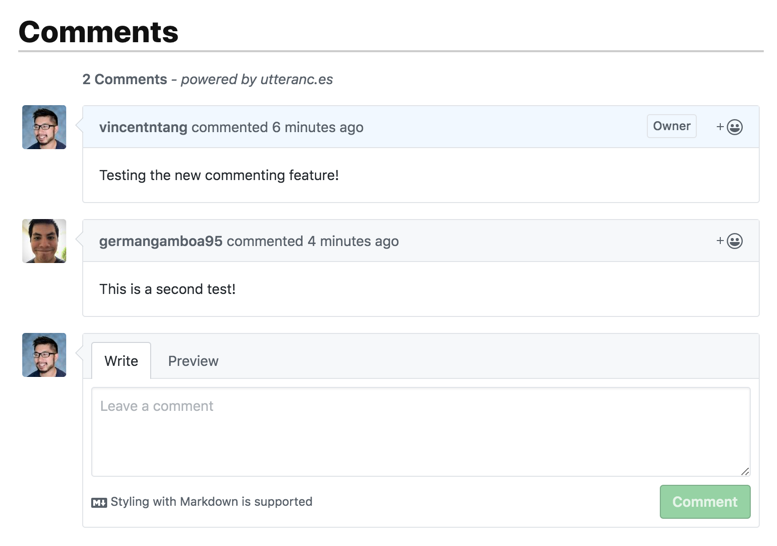
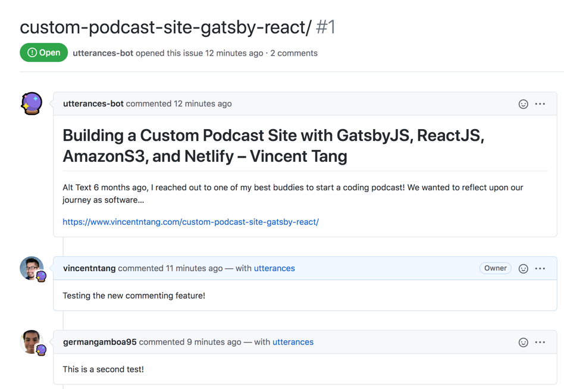

Adding a commenting system into a blog platform is really useful. I wanted something that didn't require a lot of configuration, was open source, and had data stored in a visible way in the event I needed to move around blogging platforms. I also didn't want something externally controlled like [Disqus](https://wptavern.com/disqus-hits-sites-with-unwanted-advertising-plans-to-charge-large-publishers-a-monthly-fee-to-remove-ads), as they've been known to inject ads into your site.

Enter [Utterances](https://utteranc.es/). It's based on Github's search API, so that means it's free and open-source! 
It uses Github's issue tracker to create an entry, and all comments in that entry are tied directly to a blog post

## How does it work?

So for instance, say I take my blog post on [Building a Custom Podcast Site using Gatsby, ReactJs, Netlify, and AmazonS3](https://www.vincentntang.com/custom-podcast-site-gatsby-react/)

The article lives here:

- https://www.vincentntang.com/custom-podcast-site-gatsby-react/

There is something called a "slug" or a "pathname". It's basically everything that is after the main website name, in this case, `www.vincentntang.com`. Here's the slug for the article:

- `/custom-podcast-site-gatsby-react`

If I add a comment to that blog post, here's what it looks like on the page:



I have it configured so that the utterance bot creates an issue in this repo, tied to that "slug":

- https://github.com/vincentntang/vincentntang.com-comments

This is the default out of the box setting with Utterances; the setting I used is `Issue title contains page pathname`

Also there's no code in this repo, it just has Utterances installed  on the repo, per step 2 on installation on the [utterances webpage](https://utteranc.es/). This means you install a widget on the repo and grant Utterances read/write permissions to create issues in there.

So Utterances creates an issue here, and each comment in this issue gets mapped directly into your blog post's comments.



You can check out the issue tracker created here:

- https://github.com/vincentntang/vincentntang.com-comments/issues/1

The main benefit of using Utterances is you fully own the comments on your site since it lives in your repository. Its secondary benefit is it fights spam since users have to authenticate in Github first to make a comment. There are no anonymous comments, and it creates a trust system for both the commenter and the blogger

## How do you configure this in GatsbyJs React?

It took me way too long to figure out this configuration. I'm writing the blog I wish I had read when I tried getting Utterances setup.

Utterances works by adding a `script` tag into your blog post `template`. What it does is it adds an `iframe` into your site, with the comments associated with your blog post. 

In the installation [readme](https://utteranc.es/), it suggests adding this script here:

```js
<script src="https://utteranc.es/client.js"
        repo="[ENTER REPO HERE]"
        issue-term="pathname"
        theme="github-light"
        crossorigin="anonymous"
        async>
</script>
```

For the `repo=[ENTER REPO HERE]`, this got me tripped up. I thought that it meant the full URL of the repo, in this case:

- https://github.com/vincentntang/vincentntang.com-comments

But the actual configuration for the `repo=[ENTER REPO HERE]` is:

- `vincentntang/vincentntang.com-comments`

So the full configuration for the `script` element looks like this for my current setup:

```js
<script src="https://utteranc.es/client.js"
        repo="vincentntang/vincentntang.com-comments"
        issue-term="pathname"
        theme="github-light"
        crossorigin="anonymous"
        async>
</script>
```

Hold up a moment though! There's actually more to this, you need to reference a `<div>` for where this `script` tag injects it's `<iframe>` comments. This is where I had to read through a lot of obscure blogs to find out how to set this up in GatsbyJs and React.

The best way to handle this is to create a seperate React Component for installing Utterances. I called my component `Comments.js` and wrote it in React Class Components. Here's how I add the script configuration in React:

```js
import React, {Component} from "react";
import ThemeContext from '../context/ThemeContext';
export default class Comments extends Component {
  static contextType = ThemeContext;

  constructor(props){ 
    super(props);
    this.commentBox = React.createRef(); // Creates a reference to inject the <script> element
  }
  componentDidMount () {
      const theme = this.context;
      const utteranceTheme = theme.dark ? "github-dark" : "github-light";
      let scriptEl = document.createElement("script");
      scriptEl.setAttribute("src", "https://utteranc.es/client.js");
      scriptEl.setAttribute("crossorigin","anonymous");
      scriptEl.setAttribute("async", true);
      scriptEl.setAttribute("repo", "vincentntang/vincentntang.com-comments");
      scriptEl.setAttribute("issue-term", "pathname");
      scriptEl.setAttribute( "theme", utteranceTheme);
      this.commentBox.current.appendChild(scriptEl);
  }

  render() {
    return (
        <div className="comment-box-wrapper container pt-7">
          <h1 className="mb-0">Comments</h1>
          <hr className="my-0"/>
          <div ref={this.commentBox} className="comment-box"/>
          {/* Above element is where the comments are injected */}
        </div>
    );
  }
}
```

This `Comments` class component uses `React.createRef()` to create a reference for how the Utterances `<script>` element is injected. There's a `<div ref={this.commentBox}/>` for the div element that adds the comment HTML from that `<script>` injection.

Also, I use both a dark, and a light theme mode in my blog. Utterances has a configuration for setting a theme, `github-light` and `github-dark` being the most common configurations. I use React's [Context API](https://reactjs.org/docs/context.html) to make this variable globally available, so I know when a user toggles the dark/light mode in my blog. 

This is where the code in `ComponentDidMount` comes into play:

```js
const theme = this.context;
const utteranceTheme = theme.dark ? "github-dark" : "github-light";
// .....
scriptEl.setAttribute( "theme", utteranceTheme);
```

If you don't have a dark/light theme in your app, feel free to modify the above code to a dark theme:

```js
scriptEl.setAttribute( "theme", "github-dark");
```

or a light theme:

```js
scriptEl.setAttribute("theme", "github-light");
```

That should be everything you need for setting up Utterances! You'll also need to call the `<Comments>` component too in your blog template. I put mine right below the information about the author

```js
import React, {Component} from "react"

export default class PostTemplate extends Component {
  render(){
    return (
      <Layout>
        <article>
          <div
            className="post"
            dangerouslySetInnerHTML={{ __html: postNode.html 
           }}
          />
        </article>
      <UserInfo gatsbyImg={vincentBlue} />
      <Comments/>
    </Layout>
  }
}
```

Feel free to checkout out how I setup the `<Comments>` component in my codebase:

- [Comment.js](https://github.com/vincentntang/vincentntang.com/blob/master/src/components/Comments.js)
- [Post.js](https://github.com/vincentntang/vincentntang.com/blob/master/src/templates/post.js)
- [Article with comments](https://www.vincentntang.com/custom-podcast-site-gatsby-react/)
- [Comments living in the repo issue tracker for that article](https://github.com/vincentntang/vincentntang.com-comments/issues/1)

As a final note, there are some things you should know about themes in Utterances:

> You can't change the comment theme when a user toggles light/dark mode, it's set depending on what theme is set when the user navigates to the page. You have to completely unmount the `Comments` Component and create a new seperate instance of it if you want to have toggleable dark/light modes.

