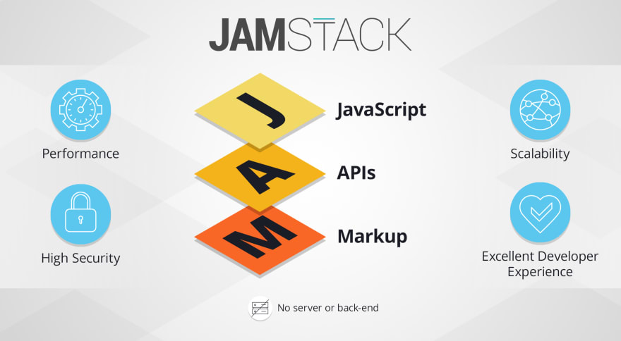
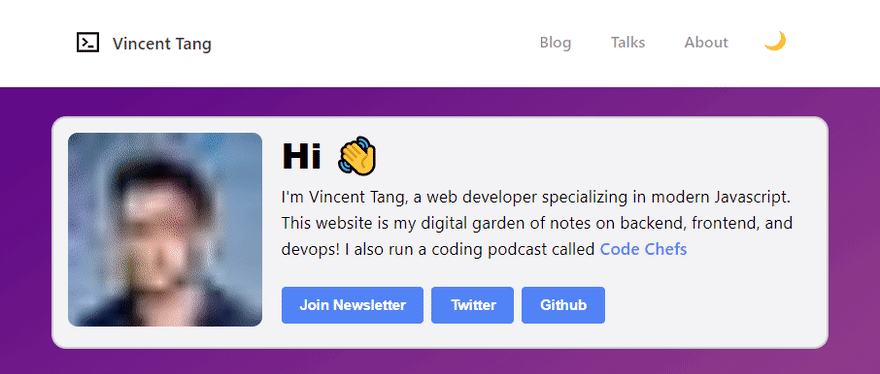

JAMstack and Static Site Generators are tools often used for building blog and marketing sites, usually as a replacement for older tools like [Wordpress](https://wordpress.com/). They provide huge performance gains to your site, don't require much maintenance, and makes scaling your content cheap and easy.

But where do such benefits come from? 

In this article, I will breakdown how Static Site Generators (SSG) work. First, by describing the original problem that it was created to solve. Next, I'll describe what JAMstacks app is, and how they evolved from SSGs. Then, I'll cover some actual tools you can use to build your next JAMstack app, such as [GatsbyJs](https://gatsbyjs.com). Finally, I'll summarize the similarities and differences between both JAMstack and SSG tools, and when to use each of these tools.

## The Good Ol' Days of PHP and HTML files in the year 2000

Back in the good ol' days, the web used to be simple. You spun up an `index.html` site, pushed it to a server, and tada! You have a webpage! Maybe it's your own personal site. Or maybe it's a marketing site. Heck, maybe you just used [Geocities](https://en.wikipedia.org/wiki/Yahoo!_GeoCities) or [myspace](https://en.wikipedia.org/wiki/Myspace) back in the day which did this for you.

Sometimes you needed more than just basic HTML. Maybe it's an e-commerce site, and you want customers to buy things online. Usually, this meant you ran a backend language like PHP to handle this for you. 

That PHP code would usually run on somebody's computer (server) and handle these interactions. It would also handle different parts of the site like:

- `https://website.com/about-us`
- `https://website.com/category/t-shirts`
- `https://website.com/products/awesome-t-shirt`

And possibly 100+ other specific suburls, usually dedicated to products and category pages. 

You could however opt and not use PHP or a server-side language, and just make 100+ index.html pages for each of these:

- `about-us.html`
- `category/t-shirts.html`
- `products/awesome-t-shirt.html`

But here's the dilemma. All 100+ of these index.html pages use the same `<header>` and `<footer>` element on the page, amongst many other things. That means if you wanted to update one small thing, you have to do the same thing everywhere else!

Let's just say now, your site isn't an e-commerce site. It's a blog now! But it still has 100+ pages and articles you've written.

You don't need to charge money on these blog articles, store customer data, or have a cart/checkout page. Your site is basically a **Read-only** site with minimal updates. There are no dynamic prices, or sales/promos. It doesn't need fancy PHP or server-side languages, it can just be plain `.html` files

But we've discussed early the problems here, updating the header on one `.html` file means you have to do it for the other 99+ `.html` files! That's ALOT of maintenance

Here's where static site generators come in!

## The coming of Static Site Generators in 2008

Static Site generators solve the maintenance issue of modifying so many `.html` files. The first major one that had a lot of traction was Jekyll in 2008 because you could deploy it on Github Pages. It was written in Ruby which is another backend language like PHP

> NOTE: Jekyll was not the first Static Site generator, but the one that made SSGs popular 

Jekyll took a unique approach to solve modifying so many `.html` files on a blogsite. Why not just create a reusable template for blogs and pages?

- Post-template.html
- Page-template.html

A post-template.html file might look something like this ([link](https://github.com/mmistakes/jekyll-theme-basically-basic/blob/master/_layouts/post.html)):

```html
---
layout: default
---



<main id="main" class="page-content" aria-label="Content">
    <article class="entry-wrap">
        {{ content }}
    </article>
</main>
```

Basically, we specify what type of layout it is, and the `{{content}}` is where the actual stuff the reader reads gets rendered. `Layout` is the entire look and feel of the site

So now if you change your HTML/CSS for the `Layout`, it changes it for all blog posts! Likewise for pages too

And why not write content in an easier way? Such as [markdown](https://daringfireball.net/projects/markdown/syntax)? And use that markdown to generate each of those pages for the `{{content}}`

- look-at-me-ma-my-first-article.md
- wtf-are-jamstackapps-and-ssgs.md

Example of the 2nd markdown file:

```md
---
title: "Post: WTF are JAMstack Apps and SSGs?"
categories:
  - Post Formats
tags:
  - Post Formats
  - readability
  - standard
---

If you've ever read an article on JAMstack apps 
or Static Site Generators (SSG), sometimes you're left.............
```

Tada! That's a static site generator! It does all the boring, heavy lifting work for you so you can generate those 100 `.html` pages with ease! And modify all the styles for all the posts in one go if you had to!

Here's the kicker with Static Site Generators. **It does run on a backend language like Ruby or PHP. BUT, it only runs every time you write a new article or modify CSS/HTML on the site**. We call this "build time", and this is why it takes a while to see changes right away. 

So because it needs to rebuild every time, it doesn't make a whole lot of sense to write an e-commerce site with it. I mean just imagine this, every time you add/remove a product from the site, you need to rebuild EVERYTHING! Even for product pages that didn't change! If you have 100,000+ products, it could take hours or even days to rebuild!

So to hit the point home, **Static Site Generators work best for READ-ONLY websites**. We're talking about things like marketing and informational sites, blog sites, podcast sites, etc. The rule of thumb for me is **if you need to update content more than twice a day or some unknown amount of times after the site is stable, you probably shouldn't use a static site generator**.

That's not to say you can't have a dynamic comments feature, or a place to gather emails. You can have this still! That's where Javascript comes in, and maybe a mini-backend living elsewhere that does all the heavy lifting for you!

Here's why JAMstack applications are so popular!

## WTF is a JAMstack application?



So what is a JAMstack app? Well, it stands for Javascript API Markup. We covered the **Markup** (ironically, which usually uses *markdown* `.md` files). **API** refers to if you wanted to integrate a separate backend for dynamic comments on a blog, using HTTP fetch methods for instance. **Javascript** is actually really broad and encompassing here, and I have to expand on this.

> NOTE: all JAMstack applications are also Static Site Generators (SSGs)! But the reverse is not true.

**Javascript** means you can use Javascript on each of your post pages. Like maybe you want to sprinkle a tiny jQuery widget on a specific page, such as something to read off how many likes you got on Twitter. Most SSGs did support this out of the box, but it becomes kind of cumbersome having all these jQuery widgets sprinkled everywhere.

But then we had a new kid on the block back in 2015. This was React, and React pretty much changed the way we wrote frontend applications.

In the first history lesson I gave about PHP and the year 2000s era, things were server-side rendered. Which meant, when a user went on different pages on the e-commerce site, the server would just send a new HTML, CSS, and JS that would be rendered on your browser like google chrome.

This is where React differs. It decouples the backend from the frontend, in that the client only talks to the backend via an API. This means you can have what's called **client-side routing** amongst many other benefits.

So that same e-commerce site example. Say you had these suburls:

- `about-us.html`
- `category/t-shirts.html`
- `products/awesome-t-shirt.html`

When the user hits the site, you can preload where all these routes live! And when a user navigates to that page, maybe the `<footer>` and `<header>` on the page is the same. But it doesn't make sense to rerender those every time a user navigates to a different part of the page.

React does what is called tree-shaking, or diff-rendering. It figures out what actually needs to change, and **only renders** those changes. So you don't rerender the `<footer>` and `<header>` every time. 

When you hear why JAMstack applications are so popular, that is what the **Javascript** portion is referring to! **These are the benefits every JAMstack article is referring to!** It uses React, which is a **single-page-application** framework that does all this magic for you.

> There's also Vue which is like React, but I omitted talking about it because the concepts and benefits are exactly the same

## So, what are some actually JAMstack tools?


So here's where I talk about [Gatsby](http://gatsbyjs.com/). Gatsby was built on React, BUT it's also built on NodeJS.

Remember when I talked a century ago about Static Site Generators? And how modifying 100+ `.html` files was a pain in the butt?. And how SSGs used a backend language like Ruby or PHP to take some markdown files to generate all these `.html` files for you?

Well, JAMstack applications do the same thing! Because **all JAMstack apps are SSGs!** And so is Gatsby too, because it's a JAMstack app!

Gatsby uses NodeJS instead of Ruby or PHP, and it builds that every time you make new `markdown` file changes. But wait Vincent, why does Gatsby (JAMstack and SSG) differ from Jekyll (SSG)?

Gatsby uses React, which has all the benefits mentioned previously! It renders only things that change, it decouples the backend, and can even preload different pages so it renders even faster! From the user's perspective, this just means the site is ooooooooohhhhh soooooo much faster, and that means better SEO and performance.

But wait there's more! I didn't mention this earlier, but SSGs and JAMstack apps also can optimize images for you too! Maybe your lazy and upload a fat 5Mb image to the site, and don't feel like compressing the files. Well, because SSGs and JAMstacks run a backend every time you upload a new markdown file, guess what! You can run image compression too and dump it into the `public` or `dist` folder, where the frontend gets rendered!

But it gets even better! Gatsby, since it's React and Javascript based, can do Javascript magic too! Instead of just pre-optimizing images, you can lazy-load images! What do I mean by this? A gif is a better explanation:



Check out my [personal site here for the example](https://vincentntang.com)! I use GatsbyJS on my personal blog, and what you see happening here is the following:

- I hard refreshed the page
- Before the image loads, a lower-res image loads first
- When the actual image loads, it replaces the lower-res image

This is really only possible with JAMstack applications like Gatsby! Traditional SSGs don't support Javascript features like this out of the box and requires a lot of work to configure. Whereas Gatsby, which uses React, has access to all the wonderful React libraries out there! It makes it easy to plug and play.

Let's not forget how easy it is to integrate 3rd party APIs! I wrote an article about how to [install blog comments in your Gatsby site](https://www.vincentntang.com/installing-gatsbyjs-blog-comments/), which uses an external API.

## In summary

In summary, I wrote this article because I find there's a lot of misconceptions about what JAMstack and Static Site Generators (SSG) are. I myself found it very confusing what the differences were until I actually played around with Jekyll, Gatsby, and many other SSGs that I didn't mention.

To summarize:

- Static Site Generators (SSG) solve the pain points of a blog, marketing, or read-only site with minimal updates. Instead of modifying 100 `.html` files, you modify a `post-template` and write markdown, and the SSG creates the `.html` files for you. Meaning, less maintenance work long term. An example of this is Jekyll
- All JAMstack apps are SSGs, but the reverse is not true. What separates JAMstack apps from SSGs is the **Javascript** portion, in that it uses more recent frontend tools like React for better UX. A JAMstack tool example is Gatsby, which uses React and NodeJS

When it comes to when to, and when not to use a JAMstack app or SSG

- JAMstack and SSGs are best for read-only sites. That means you don't want to build a dynamic and constantly updating e-commerce site with it, else you deal with crazy build times. If you're building a feature-rich web app or startup, you're actually better off building a separate backend (NodeJS) and a separate frontend (React) and not using JAMstack or SSGs.

Here's a list of popular JAMstack apps as of the end of 2020

- [Gatsby](http://gatsbyjs.com/) - which runs React
- [VuePress](https://vuepress.vuejs.org/) - which runs Vue
- [Gridsome](https://gridsome.org/) - which runs Vue

Here's a list of popular SSGs, that are technically not JAMstack apps:

- [Hugo](https://gohugo.io/) - It sometimes gets lumped in as a JAMstack app, but technically it's just an SSG since it just uses GO-lang to render files behind the scenes
- [Jekyll](https://jekyllrb.com/) - Jekyll was the first popular SSG, as you could power it on [githubpages](https://pages.github.com/) since it's written in Ruby and Github is too!
- [Hexo](https://hexo.io/) - Hexo was the first major SSG written in NodeJS. It became popular in China before it came to the states, so you'll find a lot of theme authors are Chinese. 

Check out some of the JAMstack apps I built (in Gatsby!)

- [vincentntang.com](https://vincentntang.com) - My personal blog, source code is [here](https://github.com/vincentntang/vincentntang.com)
- [codechefs.dev](https://codechefs.dev) - I run a podcast for junior to mid-level developers seeking to level up! Source code is [here](https://github.com/vincentntang/codechefs)
