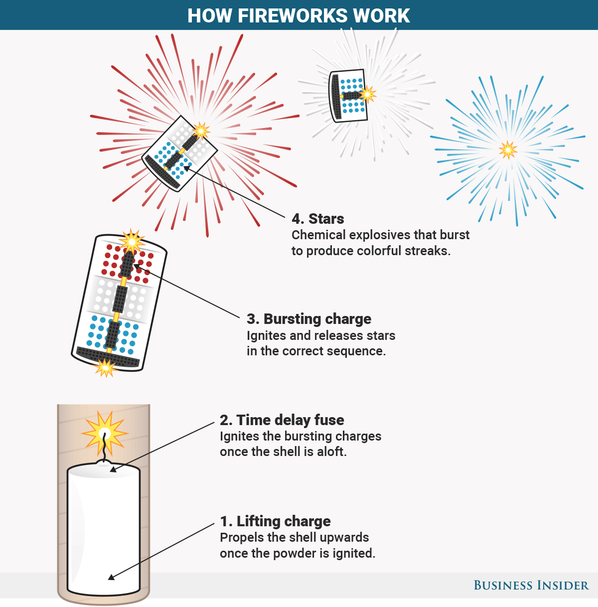

You dig through the web, looking for an explaination of how javascript promises and async/await work. Maybe you stumble upon videos such as funfunfunction that break it down conceptually. Or a stackoverflow post with live examples showing how it works. 

The concept still doesn't stick though - you need an analogy to pull it all together. You're not alone in this, I've struggled for the longest time understanding Javascript promises and async/await.

I've come up with an analogy that has finally clicked it to me, and my hope is it will be the same for you

## How does it work?

Let's step back away from Javascript land for one moment. Heck, let's go away from webdevelopment in general. Bear with me for a moment while I talk about a completely unrelated topic to build the analogy - fireworks:


You've seen these before. Maybe it was with friends and family on New Year's Eve. Maybe you watched them nightly outside your window because you grew up near Disneyworld. Or maybe you just didn't get out of the house, and watched it on TV.

Watching may be one thing, but it's possibly you've launched your own fireworks. It's hard to forget that feeling that you made something cool happen, and annoyed your neighbors while you were at it. It may have seem like fun and games at the time, but I assure you its not.

Because launching fireworks is bascally how Javascript Promises work.


Let's take a deeper look into how a common aerial shell firework is launched. By breaking down each step that happens. This Coyote and Roadrunner gif illustrates how this process works:

1. Light the rope
2. Rope burns
3. Firework is launched

Notice how once you lit the rocket, you wait until the explosion happens. That's a Javascript promise, the rope is pinky swearing that it will `resolve` into a launched rocket. If it's a rainy day, the rope will `reject` the promise.

We're not launching rockets. But we are fetching data from external sources, via promises.

When you first set out to learn webdevelopment you may have come across the json placeholder API. It's a free service for learning how to connect to a backend. For instance, if you were to go to https://jsonplaceholder.typicode.com/posts/1, you'll see a list of data like so:

```json
{
  userId: 1,
  id: 1,
  title: "sunt aut facere repellat provident occaecati excepturi optio reprehenderit",
  body: "quia et suscipit suscipit recusandae consequuntur expedita et cum reprehenderit molestiae ut ut quas totam nostrum rerum est autem sunt rem eveniet architecto"
}
```

On our client, your `index.html` or `scripts.js` file, you can fetch that data like so:

```javascript
// 1. Light the rope
    return axios({
            url: 'https://jsonplaceholder.typicode.com/posts/1', 
            method: 'get',
            timeout: 8000,
            headers: {
                'Content-Type': 'application/json',
            }
        })
        // 2. Rope burns
       .then(res => res.data) // 3. rocket launches
       .catch (err => console.error(err)) // 3. rocket NOT launched
    }
```

```javascript
function getPromise() {

    // 1. Light the rope
    return axios({
            url: 'https://jsonplaceholder.typicode.com/posts/1', 
            method: 'get',
            timeout: 8000,
            headers: {
                'Content-Type': 'application/json',
            }
        })
        // 2. Rope burns
       .then(res => res.data) // 3. rocket launches
       .catch (err => console.error(err)) // 3. rocket NOT launched
    }


getPromise()
  .then(res => console.log(res))
```

The above example is a common example of how promises are used. 

<!-- Before I delve into programming land, let's talk about how

I've had my fair share of hauls buying fireworks from a random popup store in the middle of the road. Time was not wasted here my friend, because this is how I'm going to explain Javascript Promises.

Promises can be explained in the context of fireworks
(bel

Launching Fireworks is basically how they work.

Wait what? You might be asking

Maybe you've even launched your own fireworks on the 4th of July. Nothing as fancy or big as the gif, but it still counts right?

Launching fireworks... is basically how Javascript promises work

Wait what?

Let's break down first how a common Aerial Shell firework works. The same one in the gif above. There's a great gif here by business insider:



There's two types of fuse systems


It's possibly you've even shot off your own fireworks on July 4th. I grew up near Disneyworld in Orlando, so fireworks were something I saw nightly.

The most common type of firework is called an Aerial Shell, as shown in the gif. It's a rocket payload that gets launched into the air, and explodes once into a dazzling spectable.


IT works

We can break it down to two fundamental steps

A small rocket that launches into the air, and explodes against the beautiful night sky.

The most common firework is called an Aerial Shell, as shown in the gif. Here's how it works:

A brilliant explosion in the night's sky. How do these work?

A fireworks show is comprised of many types of fireworks. The most common one is an aerial shell:

(show gif)

Aerial shells 

Let's talk about how a firework gets launched into the air. If you grew up when Coyote and Roadrunner was a thing, 

(show gif of Coyote getting blown up on fuse)

Fireworks use a fuse system, where an ignition source is needed to light the rope. We can break down the steps from start to finish, of how an person launches a firework:

1. Take a heat source
2. Light up the rope
3. Wait for rope to extend
4. Watch the firework launch

Javascript promises are no different. Here's an example of code to illustrate that same workflow:

```
put code here, with promise then

```

Promises -->
